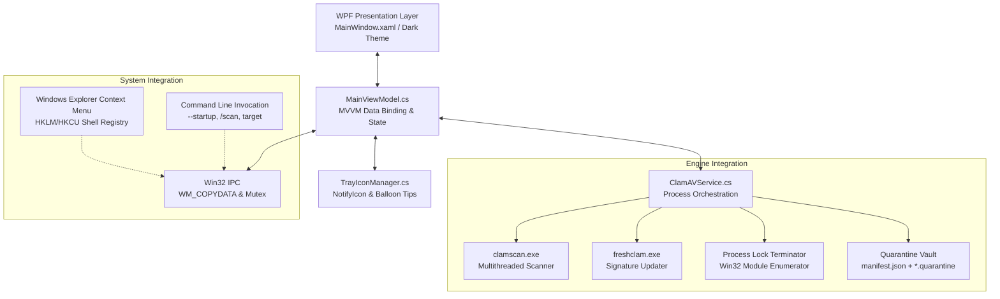

# Architecture & Technical Design — LibreScan Security

## System Architecture

---

## Core Components

### 1. Single-Instance Architecture & `WM_COPYDATA` IPC
- **Named Mutex**: `Local\LibreScanSecurity_SingleInstanceMutex` enforces single-process execution.
- **IPC Target Forwarding**: When a user right-clicks a file in Windows Explorer or executes `LibreScan.exe "C:\sample.exe"` while an existing instance is already running:
  1. Secondary instance opens named mutex, detects existing owner.
  2. Resolves primary window handle via `FindWindowW(null, "LibreScan Security")` or process main window fallback.
  3. Sends unicode target string via Win32 `WM_COPYDATA` with `SendMessageW`.
  4. Primary window uses UIPI filter (`ChangeWindowMessageFilter`) to receive messages across elevation boundaries, restores from tray with `SetForegroundWindow`, and starts scanning immediately.
  5. Secondary process terminates instantly.

---

### 2. ClamAV Process Management & Zombie Protection
- **Process Spawning**: `ProcessStartInfo` configured with `UseShellExecute = false`, `CreateNoWindow = true`, `RedirectStandardOutput = true`, and UTF-8 encoding.
- **Tree Kill Protection**: Uses `ct.Register(() => process.Kill(entireProcessTree: true))` to ensure that if a scan is canceled or the user exits, `clamscan.exe` and any child worker processes are killed cleanly without leaving orphaned background CPU consumers.
- **Output Throttling**: Live progress updates are debounced:
  - File counter updates are throttled to 50ms intervals (~20 FPS) to prevent WPF Dispatcher queue saturation on 100,000+ file scans.
  - Activity log OK/clean file lines are throttled to 5 updates/sec (200ms).
  - Threat detection lines are never throttled and dispatch immediately.

---

### 3. Malware File-Locking & Kernel Execution Termination
- **Problem**: Running malware processes hold Win32 kernel execution locks (`ERROR_SHARING_VIOLATION` / `ERROR_ACCESS_DENIED`). Calling `File.Move` or `File.Delete` directly fails.
- **Solution**: `TryTerminateProcessesUsingFile(filePath)` enumerates running processes, checks process module paths (`proc.MainModule.FileName`), forcibly terminates locking processes with `proc.Kill(entireProcessTree: true)`, waits for handle release, strips `ReadOnly` file attributes, and applies multi-attempt retry with exponential backoff before quarantine isolation.

---

### 4. Quarantine Vault & Atomic Manifest Architecture
- **Isolation Format**: Each infected file is moved into `Quarantine/<Guid>.quarantine`.
- **Manifest Integrity**: Metadata (original path, threat name, timestamp) is maintained in `Quarantine/manifest.json`.
- **Concurrency & Atomicity**:
  - Protected by `SemaphoreSlim ManifestLock`.
  - Atomic saves: written to a unique `.tmp` file and committed with atomic `File.Move(overwrite: true)`.
  - Corrupt recovery: transient `IOException`s are retried up to 3 times before returning. True `JsonException` syntax corruptions are backed up to `.corrupt_<timestamp>` rather than deleted.
  - ReadOnly safety: `RestoreFromQuarantineAsync` strips `ReadOnly` attributes from both source quarantine files and destination targets before restoring.

---

### 5. Application State & Scan Persistence
- Persisted to `%LocalAppData%\LibreScan\state.json`.
- Records last scan timestamp, files scanned count, threats found, and scan profile.
- Restores seamlessly into UI status cards on cold launch.
- Crash logs are captured safely from `DispatcherUnhandledException`, `AppDomain.UnhandledException`, and `TaskScheduler.UnobservedTaskException` to `%LocalAppData%\LibreScan\crash.log`.
